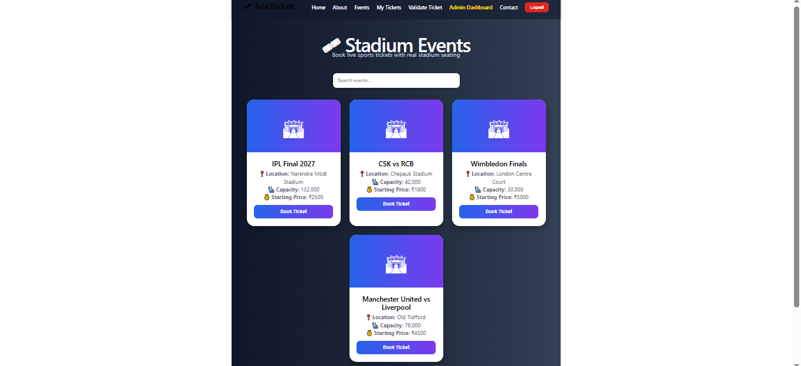
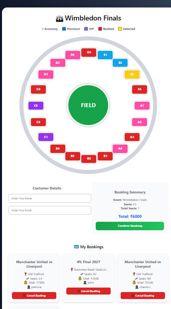
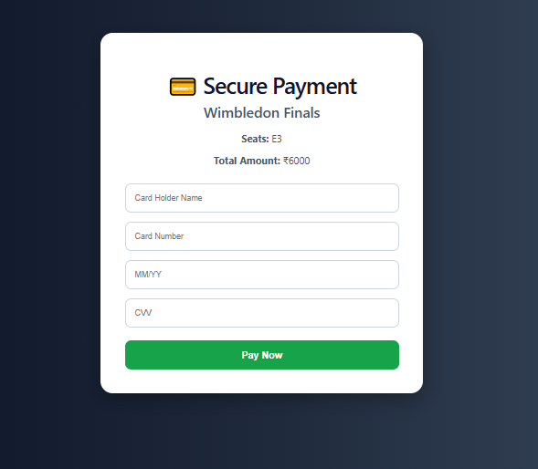
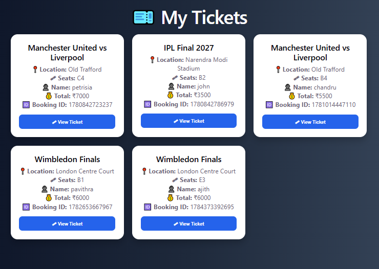
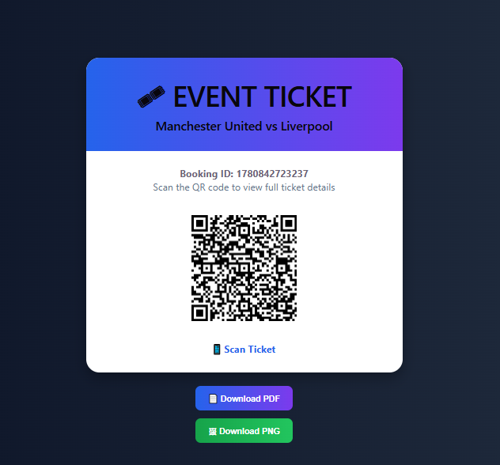
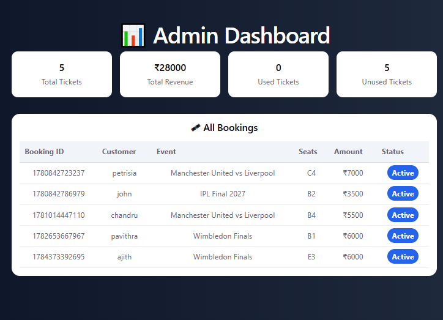
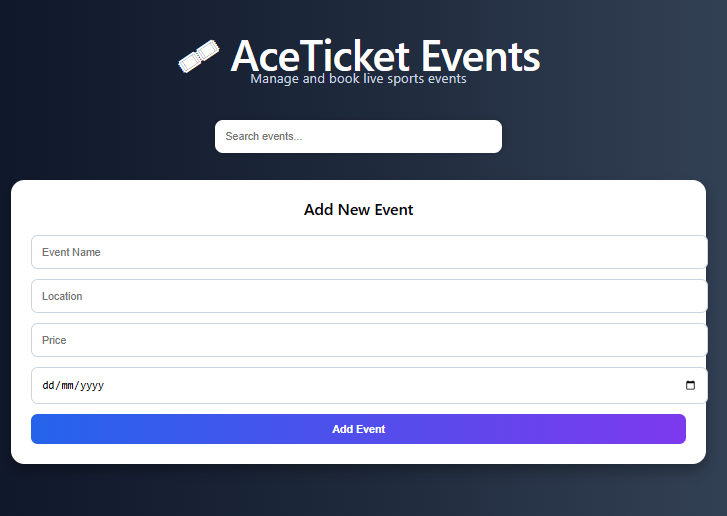

# 🎟️ AceTicket - Event Ticket Booking System

AceTicket is a full-stack event ticket booking web application developed using **React**, **Vite**, **Spring Boot**, and **MySQL**. It enables users to browse sports events, select seats, complete a secure payment simulation, generate digital tickets, and manage bookings through an intuitive interface. The application also includes an Admin Dashboard for event management.

---

## 🚀 Features

### 👤 User Features

- User Registration & Login
- Browse Sports Events
- Search Events
- Interactive Seat Selection
- Secure Payment Simulation
- Booking Confirmation
- My Tickets
- View Ticket
- Download Ticket as PDF
- Download Ticket as PNG
- Ticket Validation

### 🔐 Admin Features

- Admin Login
- Dashboard Overview
- Add New Events
- Edit Existing Events
- Delete Events
- Manage Event Listings (CRUD Operations)

---

## 🛠️ Technologies Used

### Frontend

- React
- Vite
- React Router DOM
- Axios
- JavaScript (ES6+)
- HTML5
- CSS3
- jsPDF
- html2canvas

### Backend

- Java
- Spring Boot
- Spring Data JPA
- MySQL
- Maven

### Tools

- Git
- GitHub
- VS Code
- Postman
- Vercel

---

## 📁 Project Structure

```
AceTicket
│
├── public
├── screenshots
├── src
│   ├── components
│   ├── pages
│   ├── services
│   ├── App.jsx
│   └── main.jsx
│
├── package.json
├── vite.config.js
└── README.md
```

---

## 📷 Application Screenshots

### 🏠 Home Page


---

### 🎫 Events Page



---

### 🪑 Seat Selection



---

### 💳 Secure Payment



---

### 🎟️ My Tickets



---

### 📄 Ticket View



---

### 🔐 Admin Dashboard



---

### ✏️ Event Management (CRUD)



---

## 💻 Installation

### Clone the Repository

```bash
git clone https://github.com/pavithra56558/AceTicket.git
```

### Navigate to the Project

```bash
cd AceTicket
```

### Install Dependencies

```bash
npm install
```

### Run the Application

```bash
npm run dev
```

The application will be available at:

```
http://localhost:5173
```

---

## 📌 Future Enhancements

- Online Payment Gateway Integration (Stripe/Razorpay)
- Email Ticket Confirmation
- QR Code Ticket Validation
- User Profile Management
- Booking History from Database
- Cloud Database Deployment
- Backend Deployment on Render

---

## 👩‍💻 Developed By

**Pavithra**

GitHub: https://github.com/pavithra56558

---

## ⭐ If you found this project helpful, consider giving it a Star!